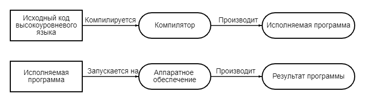
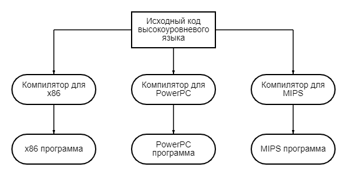

# Введения в языки программирования

Современные компьютеры невероятно быстры и с каждым разом становятся все быстрее. Однако у компьютеров также есть некоторые существенные ограничения: они изначально понимают только ограниченный набор команд, и им нужно точно указывать, что делать.

**Компьютерная программа** (также обычно называемая **приложением**) - это набор инструкций, которые компьютер может выполнять для выполнения некоторой задачи. Процесс создания программы называется **программированием**. Программисты обычно создают программы путем создания **исходного кода** (обычно сокращенного до **"кода"**), который представляет собой список команд, введенных в один или несколько текстовых файлов.

Совокупность физических компьютерных частей, которые составляют компьютер и выполняют программы, называется **аппаратным обеспечением**. Когда компьютерная программа загружается в память и последовательно выполняет каждую инструкцию, это называется **запуском** или **исполняемой** программой.

# Язык компьютера

Центральный процессор компьютера не способен понимать C++. Ограниченный набор инструкций, который центральный процессор может понимать напрямую, называется **машинным кодом** (или **машинным языком**, или **набором команд**).

Вот пример инструкции на машинном языке: 
> 10110000 01100001

В те времена, когда только были изобретены компьютеры, программистам приходилось писать программы непосредственно на машинном языке, что было очень сложным и отнимающим много времени занятием.

То, как организованы эти инструкции, выходит за рамки данного введения, но интересно отметить две вещи. Во-первых, каждая инструкция состоит из последовательности 1 и 0. Каждый отдельный 0 или 1 называется **двоичной цифрой**, или сокращенно **битом**. Количество битов, составляющих одну команду, варьируется - например, некоторые процессоры обрабатывают инструкции, длина которых всегда составляет 32 бита, в то время как некоторые другие процессоры (например, семейства x86/x64, которые вы, возможно, используете) имеют инструкции переменной длины.

Во-вторых, каждый набор двоичных цифр интерпретируется процессором в команду для выполнения очень специфической работы, такой как сравнение этих двух чисел или помещение этого числа в указанную ячейку памяти. Однако, поскольку разные процессоры имеют разные наборы команд, инструкции, написанные для одного типа процессора, не могут быть использованы на процессоре, который не использует один и тот же набор команд. Это означало, что программы, как правило, не были **переносимыми** (пригодными для использования без серьезных переделок) на различные типы систем, и их приходилось писать заново.

# Язык ассемблера

Поскольку машинный язык сложен для чтения и понимания человеком, был изобретен язык ассемблера. В языке ассемблера каждая инструкция идентифицируется короткой аббревиатурой (а не набором битов), и могут использоваться имена и другие цифры.

Вот та же инструкция, что и выше, на языке ассемблера: 
> mov al, 061h

Это делает ассемблер намного проще для чтения и записи, чем машинный язык. Однако центральный процессор не может понимать язык ассемблера напрямую. Вместо этого программа ассемблера должна быть переведена на машинный язык, прежде чем она сможет быть выполнена компьютером. Это делается с помощью программы, называемой **ассемблером**. Программы, написанные на языках ассемблера, как правило, очень быстры, и ассемблер все еще используется сегодня, когда скорость имеет решающее значение.

Однако у ассемблера все еще есть некоторые недостатки. Во-первых, языки ассемблера по-прежнему требуют большого количества инструкций для выполнения даже простых задач. Хотя сами по себе отдельные инструкции в некоторой степени удобочитаемы для человека, понимание того, что делает программа в целом, может быть сложной задачей (это немного похоже на попытку понять предложение, рассматривая каждую букву в отдельности). Во-вторых, язык ассемблера все еще не очень переносим - программа, написанная на ассемблере для одного процессора, скорее всего, не будет работать на оборудовании, использующем другой набор команд, и ее придется переписывать или сильно модифицировать.

# Высокоуровневые языки

Чтобы решить проблемы удобочитаемости и переносимости, были разработаны новые языки программирования, такие как C, C++, Pascal (а позже и такие языки, как Java, Javascript и Perl). Эти языки называются языками высокого уровня, поскольку они предназначены для того, чтобы позволить программисту писать программы, не беспокоясь о том, на каком компьютере программа будет запущена.

Вот та же инструкция, что и выше в C/C++: 
> a = 97;

Подобно программам на ассемблере, программы, написанные на языках высокого уровня, должны быть переведены в формат, понятный компьютеру, прежде чем их можно будет запустить. Это делается двумя основными способами: компиляцией и интерпретацией.

**Компилятор** - это программа (или набор программ), которая считывает исходный код (обычно написанный на языке высокого уровня) и переводит его на какой-либо другой язык (обычно язык низкого уровня, такой как ассемблер или машинный язык и т.д.). Чаще всего эти языковые файлы низкого уровня затем объединяются в исполняемый файл (содержащий инструкции на машинном языке), который можно запускать или распространять среди других пользователей. Примечательно, что для запуска исполняемого файла не требуется установка компилятора.

Вначале компиляторы были примитивными и создавали медленный, неоптимизированный код. Однако с годами компиляторы стали очень хороши в создании быстрого, оптимизированного кода и в некоторых случаях могут выполнять работу лучше, чем люди на языке ассемблера!

Вот упрощенное представление процесса компиляции:

Поскольку программы на C++ обычно компилируются, вскоре мы рассмотрим компиляторы на C++ более подробно.

**Интерпретатор** - это программа, которая непосредственно выполняет инструкции в исходном коде, не требуя их предварительной компиляции в исполняемый файл. Интерпретаторы, как правило, более гибкие, чем компиляторы, но менее эффективны при запуске программ, поскольку процесс интерпретации необходимо выполнять каждый раз при запуске программы. Это также означает, что интерпретатор должен быть установлен на каждом компьютере, где будет выполняться интерпретируемая программа.

Вот упрощенное представление процесса интерпретирования:

> [!NOTE]
>
>Хорошее сравнение преимуществ компиляторов и интерпретаторов можно найти [здесь](https://stackoverflow.com/questions/38491212/difference-between-compiled-and-interpreted-languages/38491646#38491646).
>
>Еще одно преимущество скомпилированных программ заключается в том, что для распространения скомпилированной программы не требуется распространять исходный код. В среде без открытого исходного кода это важно для целей защиты интеллектуальной собственности.

Большинство языков могут быть скомпилированы или интерпретированы. Традиционно такие языки, как C, C++ и Pascal, компилируются, тогда как “скриптовые” языки, такие как Perl и Javascript, как правило, интерпретируются. Некоторые языки, такие как Java, используют сочетание этих двух.

Языки высокого уровня обладают многими желательными свойствами.

Во-первых, языки высокого уровня намного проще читать и писать, потому что команды ближе к естественному языку, который мы используем каждый день. Во-вторых, языкам высокого уровня требуется меньше инструкций для выполнения той же задачи, что и языкам более низкого уровня, что делает программы более краткими и понятными. В C++ вы можете сделать что-то вроде 'a = b * 2 + 5;' в одной строке. На языке ассемблера для этого потребовалось бы 5 или 6 различных инструкций.

В-третьих, программы могут быть скомпилированы (или интерпретированы) для множества различных систем, и вам не нужно изменять программу для запуска на разных процессорах (вы просто перекомпилируете для этого процессора). В качестве примера:

Есть два общих исключения из переносимости (portable).

Первое заключается в том, что многие операционные системы, такие как Microsoft Windows, содержат возможности, зависящие от платформы, которые вы можете использовать в своем коде. Это может значительно упростить написание программы для конкретной операционной системы, но за счет переносимости. В этих руководствах мы будем избегать какого-либо кода, специфичного для конкретной платформы.

Во-вторых, некоторые компиляторы также поддерживают расширения, специфичные для компилятора - если вы используете их, ваши программы не смогут быть скомпилированы другими компиляторами, которые не поддерживают те же расширения, без изменений. Мы поговорим подробнее об этом позже, когда вы установите компилятор.

# Правила (Important), лучшие практики (Tip), и предупреждение (Warning)

> [!IMPORTANT]
> Правила - это инструкции, которые вы должны выполнять в соответствии с требованиями языка. Несоблюдение правил, как правило, приводит к тому, что ваша программа не работает.

> [!TIP]
> Лучшие практики - это то, что вам следует делать, потому что такой способ ведения дел является либо общепринятым (идиоматическим), либо рекомендуемым. То есть либо все делают это таким образом (и если вы поступите иначе, вы будете делать то, чего люди не ожидают), либо это превосходит альтернативы.

> [!WARNING]
> Предупреждения - это то, чего вам не следует делать, потому что они, как правило, приводят к неожиданным результатам.
