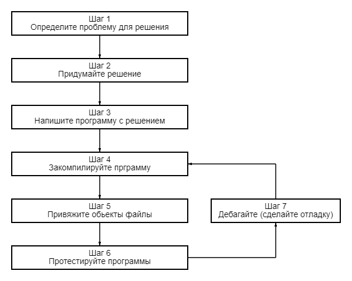

# Введение в разработку на C++

Прежде чем мы сможем написать и выполнить нашу первую программу на C++, нам нужно более подробно разобраться в том, как разрабатываются программы на C++. Вот график, описывающий упрощенный подход:



# Шаг 1: определите проблему которую вы хотите решить

Это шаг “что”, на котором вы выясняете, какую проблему вы собираетесь решить. Выработка первоначальной идеи для того, что вы хотели бы запрограммировать, может быть самым простым шагом или самым трудным. Но концептуально это самый простой. Все, что вам нужно, - это идея, которую можно четко сформулировать, и вы готовы к следующему шагу.

Вот несколько примеров:
 - “Я хочу написать программу, которая позволит мне вводить много чисел, а затем вычислять среднее значение”.
 - “Я хочу написать программу, которая генерирует двумерный лабиринт и позволяет пользователю перемещаться по нему. Пользователь выигрывает, если достигает конца”.
 - “Я хочу написать программу, которая считывает данные о ценах на акции из файла и предсказывает, пойдут ли акции вверх или вниз”.

# Шаг 2: определите как вы хотите решить проблему

Это шаг “как”, на котором вы определяете, как вы собираетесь решить проблему, с которой столкнулись на шаге 1. Это также шаг, которым больше всего пренебрегают при разработке программного обеспечения. Суть проблемы в том, что существует множество способов решения проблемы, однако некоторые из этих решений хороши, а некоторые плохи. Слишком часто программисту приходит в голову идея, он садится и немедленно начинает писать решение. В результате часто получается решение, которое попадает в категорию плохих.

Как правило, хорошие решения обладают следующими характеристиками:
 - Они просты (не слишком сложны или сбивают с толку).
 - Они хорошо документированы (особенно в отношении любых сделанных предположений или ограничений).
 - Они построены по модулю, поэтому части могут быть повторно использованы или изменены позже, не влияя на другие части программы.
 - Они надежны и могут восстанавливать или выдавать полезные сообщения об ошибках, когда происходит что-то неожиданное.

Когда вы садитесь и сразу же начинаете программировать, вы, как правило, думаете: “Я хочу сделать <что-нибудь>”, поэтому вы внедряете решение, которое приведет вас к цели быстрее всего. Это может привести к тому, что программы станут хрупкими, их будет трудно изменить или расширить позже, или они будут содержать множество ошибок (технических дефектов).

>[!NOTE]
>## В качестве отступления…
>
>Термин "ошибка" впервые был использован Томасом Эдисоном еще в 1870-х годах! Однако популяризацию этот термин получил в 1940-х годах, когда инженеры обнаружили настоящую моль, застрявшую в аппаратном обеспечении раннего компьютера, что вызвало короткое замыкание. И бортовой журнал, в котором сообщалось об ошибке, и мотылек теперь являются частью Смитсоновского музея американской истории. Его можно посмотреть здесь.

Исследования показали, что только 20% времени программиста на самом деле тратится на написание начальной программы. Остальные 80% тратятся на техническое обслуживание, которое может состоять из **отладки** (устранения ошибок), обновлений для адаптации к изменениям в среде (например, для запуска в новой версии ОС), улучшений (незначительные изменения для улучшения удобства использования или возможностей) или внутренних улучшений (для повышения надежности или ремонтопригодности).

>[!NOTE]
>## В качестве отступления…
>
>Это отличная иллюстрация [принципа Парето](https://ru.wikipedia.org/wiki/%D0%97%D0%B0%D0%BA%D0%BE%D0%BD_%D0%9F%D0%B0%D1%80%D0%B5%D1%82%D0%BE).

Следовательно, стоит потратить немного дополнительного времени заранее (до того, как вы начнете программист) на размышления о наилучшем способе решения проблемы, о том, какие предположения вы делаете и как вы могли бы планировать на будущее, чтобы сэкономить себе много времени и хлопот в будущем.

Мы подробнее поговорим о том, как эффективно разрабатывать решения проблем, на следующем уроке.

# Шаг 3: Напишите программу

Чтобы написать программу, нам нужны две вещи: во-первых, нам нужно знание языка программирования - вот для чего нужны эти руководства! Во-вторых, нам нужен текстовый редактор для написания и сохранения наших написанных программ. Программы, которые мы пишем с использованием инструкций на C++, называются **исходным кодом** (часто сокращается до просто **кода**). Можно написать программу, используя любой текстовый редактор, который вы хотите, даже такой простой, как Windows notepad или Unix vi или pico.

Программа, набранная в обычном текстовом редакторе, выглядела бы примерно так:

```
#include <iostream>

int main()
{
    std::cout << "Привет, мир!";
    return 0;
}
```

Однако мы настоятельно рекомендуем вам использовать редактор, предназначенный для программирования (называемый **редактором кода**). Не волнуйтесь, если у вас его еще нет. Вскоре мы расскажем, как установить редактор кода.

Обычный редактор, предназначенный для кодирования, имеет несколько функций, которые значительно упрощают программирование, включая:
 - Нумерацию строк. Нумерация строк полезна, когда компилятор выдает нам ошибку, поскольку типичная ошибка компилятора будет указывать: какой-то код ошибки/сообщение, строка 64. Без редактора, который отображает номера строк, поиск строки 64 может стать настоящей проблемой.
 - Подсветка синтаксиса и раскраска. Подсветка синтаксиса и раскраска изменяет цвет различных частей вашей программы, чтобы упростить идентификацию различных компонентов вашей программы.
 - Однозначный шрифт фиксированной ширины (часто называемый “моноширинным шрифтом”). Непрограммируемые шрифты часто затрудняют различение между цифрой 0 и буквой O или между цифрой 1, буквой l (строчная буква L) и буквой I (заглавная буква i). Хороший программный шрифт обеспечит визуальную дифференциацию этих символов, чтобы гарантировать, что один случайно не будет использован вместо другого. Во всех редакторах кода это должно быть включено по умолчанию, но в стандартном текстовом редакторе может быть и нет. Использование шрифта фиксированной ширины (где все символы имеют одинаковую ширину) упрощает правильное форматирование и выравнивание вашего кода.

Вот пример программы на C++ с нумерацией строк, подсветкой синтаксиса и шрифтом фиксированной ширины:

```c++
#include <iostream>

int main()
{
    std::cout << "Привет, мир!";
    return 0;
}
```

Обратите внимание, насколько это проще для понимания, чем версия без выделения. Исходный код, который мы показываем в этом руководстве, будет иметь как нумерацию строк, так и подсветку синтаксиса, чтобы облегчить понимание этого кода.

>[!NOTE]
> В [Coding Font](https://www.codingfont.com/) есть удобный инструмент, позволяющий сравнивать различные шрифты для кодирования, чтобы увидеть, какой из них вам нравится больше.

>[!NOTE]
>## Для продвинутых читателей
> Поскольку исходный код написан с использованием символов ASCII, языки программирования используют определенное количество символов ASCII для представления математических концепций. Например, ≠ не является частью набора символов ASCII, поэтому языки программирования обычно используют != вместо этого для представления математического неравенства.
>
> Некоторые программные шрифты, такие как [Fira Code](https://github.com/tonsky/FiraCode), используют лигатуры, чтобы объединить такие “рисунки” обратно в один символ. Например, вместо отображения !=, Fira Code отобразит ≠ (используя ту же ширину, что и двухсимвольная версия). Некоторым людям это легче читается, другие предпочитают придерживаться более буквальной интерпретации основных символов.

Программы, которые вы пишете, обычно будут называться something.cpp, где something заменяется названием программы по вашему выбору (например, калькулятор, hi-lo и т.д.). Расширение .cpp сообщает компилятору (и вам), что это файл исходного кода C++, содержащий инструкции C++. Обратите внимание, что некоторые люди используют расширение .cc (или .cxx) вместо .cpp, но мы рекомендуем вам использовать .cpp.

>[!TIP]
>## Наилучшая практика
>
> Назовите ваши файлы кода something.cpp, где something - это имя по вашему выбору, а .cpp - это расширение, указывающее, что файл является исходным файлом C++.

Также обратите внимание, что многие сложные программы на C++ содержат несколько cpp-файлов. Хотя большинство программ, которые вы будете создавать изначально, будут содержать только один cpp-файл, можно написать отдельные программы, содержащие десятки или сотни cpp-файлов.

Как только мы напишем нашу программу, следующие шаги - преобразовать исходный код во что-то, что мы можем запустить, а затем посмотреть, работает ли это! Мы обсудим эти шаги (4-7) в следующем уроке.
