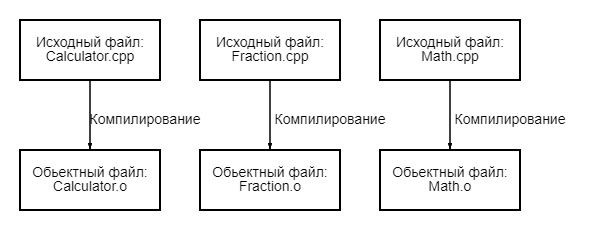
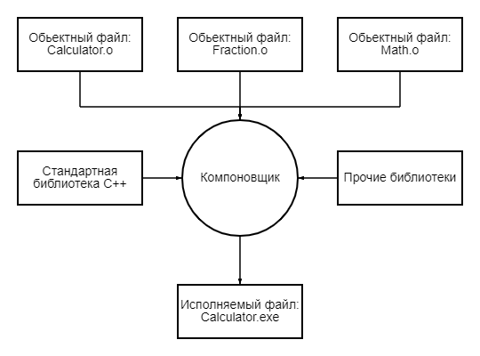

# Введение в компиляцию, линкер и библиотеки

Продолжая наше обсуждение этой диаграммы из предыдущего урока [0.4 - Введение в разработку на C++](Глава%200%20-%20Введение/0.4%20Введение%20в%20разработку%20на%20C%2B%2B.md):

Давайте обсудим шаги 4-7.

# Шаг 4: Компиляция вашего исходного кода

Для компиляции файлов исходного кода C++ мы используем компилятор C++. Компилятор C++ последовательно просматривает каждый файл исходного кода (.cpp) в вашей программе и выполняет две важные задачи:

Сначала компилятор проверяет ваш код на C++, чтобы убедиться, что он соответствует правилам языка C++. Если это не так, компилятор выдаст вам сообщение об ошибке (и соответствующий номер строки), чтобы помочь точно определить, что нуждается в исправлении. Процесс компиляции также будет прерван до тех пор, пока ошибка не будет исправлена.

Во-вторых, компилятор преобразует ваш код C++ в инструкции машинного языка. Эти инструкции хранятся в промежуточном файле, называемом **объектным файлом**. Объектный файл также содержит метаданные, которые требуются или полезны на последующих этапах.

Объектные файлы обычно называются name.o или name.obj, где name - это то же имя, что и cpp-файл, из которого он был создан.

Например, если в вашей программе было 3 .cpp-файла, компилятор сгенерирует 3 объектных файла:

Компиляторы C++ доступны для многих различных операционных систем. Вскоре мы обсудим установку компилятора, поэтому сейчас в этом нет необходимости.

# Шаг 5: Связывание объектных файлов и библиотек

После успешного завершения работы компилятора запускается другая программа, называемая **компоновщиком** (**Линкер**, запомните пожалуйста это слово). Задача компоновщика состоит в объединении всех объектных файлов и создании желаемого выходного файла (обычно исполняемого файла). Этот процесс называется **компоновкой**.

Сначала компоновщик считывает каждый из объектных файлов, сгенерированных компилятором, и убеждается, что они допустимы.

Во-вторых, компоновщик гарантирует, что все межфайловые зависимости разрешены должным образом. Например, если вы определяете что-то в одном cpp-файле, а затем используете это в другом cpp-файле, компоновщик соединяет их вместе. Если компоновщику не удается связать ссылку на что-либо с его определением, вы получите сообщение об ошибке компоновщика, и процесс компоновки будет прерван.

В-третьих, компоновщик также способен связывать библиотечные файлы. **Библиотечный файл** - это набор предварительно скомпилированного кода, который был “упакован” для повторного использования в других программах.

C++ поставляется с обширной библиотекой, называемой **стандартной библиотекой C++** (обычно сокращенной до standard library), которая предоставляет набор полезных возможностей для использования в ваших программах. Одной из наиболее часто используемых частей стандартной библиотеки C++ является библиотека iostream, которая содержит функциональные возможности для печати текста на мониторе и получения ввода с клавиатуры от пользователя. Почти каждая программа, написанная на C++, использует стандартную библиотеку в той или иной форме, поэтому очень часто ссылки на стандартную библиотеку встраиваются в ваши программы. Большинство компоновщиков автоматически создают ссылки в стандартной библиотеке, как только вы используете какую-либо ее часть, так что, как правило, вам не о чем беспокоиться.

Вы также можете при желании связать другие библиотеки. Например, если бы вы собирались написать программу, воспроизводящую звуки, вы, вероятно, не захотели бы писать свой собственный код для считывания звуковых файлов с диска, проверки их корректности или выяснения того, как направить звуковые данные в операционную систему или аппаратное обеспечение для воспроизведения через спикер - это было бы очень много работы! Вместо этого вы, вероятно, загрузили бы библиотеку, которая уже знает, как это делать, и использовали бы ее. Мы поговорим о том, как создавать ссылки в библиотеках (и создавать свои собственные!) в приложении.

Как только компоновщик завершит связывание всех объектных файлов и библиотек, тогда (при условии, что все пройдет хорошо) у вас будет исполняемый файл, который вы сможете запустить.

# Сборка

Поскольку здесь задействовано несколько этапов, термин **"сборка"** (building) часто используется для обозначения полного процесса преобразования файлов исходного кода в исполняемый файл, который может быть запущен. Конкретный исполняемый файл, созданный в результате сборки, иногда называется **сборкой** (build).

>[!NOTE]
>## Для продвинутых читателей
>
>Для сложных проектов часто используются средства автоматизации сборки (такие как **make** или **build2**), помогающие автоматизировать процесс создания программ и запуска автоматических тестов. Хотя такие инструменты являются мощными и гибкими, поскольку они не являются частью основного языка C++, и вам не нужно их использовать для продолжения работы, мы не будем обсуждать их в рамках этой серии руководств.

# Шаги 6 и 7: Тестирование и отладка

Это самая интересная часть (надеюсь)! Вы можете запустить свой исполняемый файл и посмотреть, выдает ли он тот результат, который вы ожидали!

Если ваша программа запущена, но работает некорректно, значит, пришло время провести некоторую отладку, чтобы выяснить, что не так. Вскоре мы обсудим, как тестировать ваши программы и как их отлаживать более подробно.

# Интегрированные среды разработки (IDE)

Обратите внимание, что все шаги 3, 4, 5 и 7 связаны с программным обеспечением, которое необходимо установить (редактор, компилятор, компоновщик, отладчик). Хотя для каждого из этих действий можно использовать отдельные программы, пакет программного обеспечения, известный как интегрированная среда разработки (IDE), объединяет все эти функции вместе. Мы обсудим IDE и установим одну из них в следующем разделе.