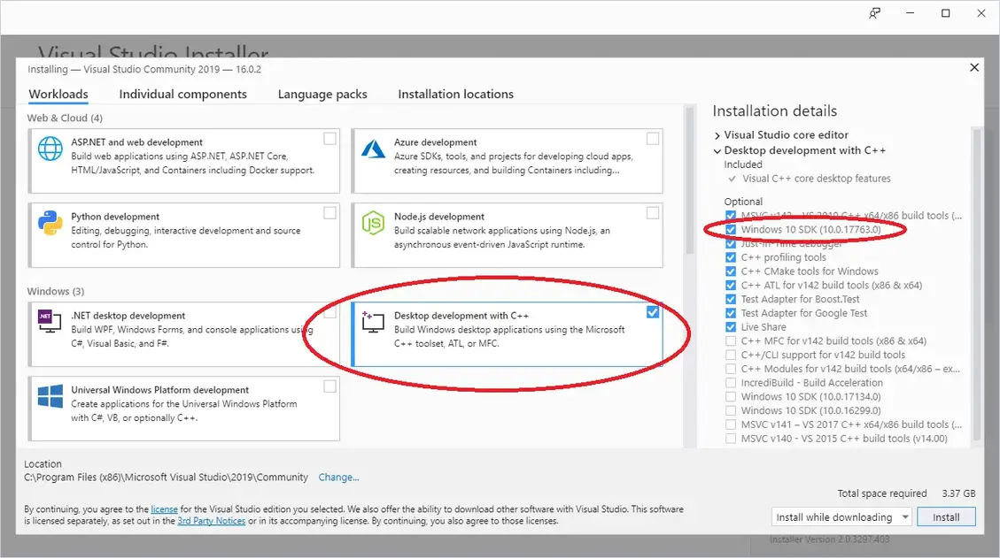
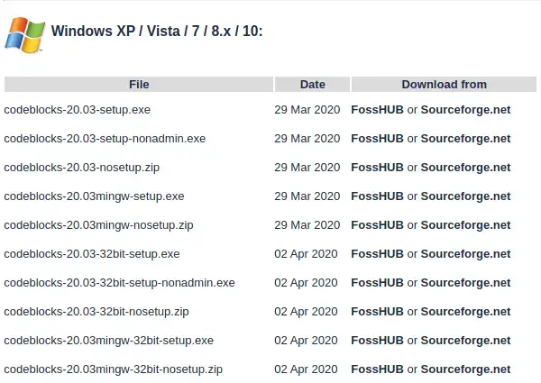
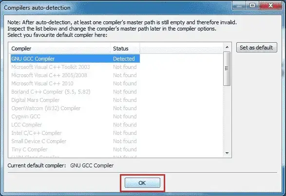

# Установка интегрированной среды разработки (IDE)

**Интегрированная среда разработки (IDE)** - это часть программного обеспечения, предназначенная для упрощения разработки, сборки и отладки ваших программ.

Типичная современная среда IDE включает в себя:

 - Какой-либо способ простой загрузки и сохранения файлов вашего кода.
 - Редактор кода с удобными для программирования функциями, такими как нумерация строк, подсветка синтаксиса, встроенная справка, заполнение имени и автоматическое форматирование исходного кода.
 - Базовая система сборки, которая позволит вам скомпилировать и связать вашу программу в исполняемый файл, а затем запустить его.
 - Встроенный отладчик, облегчающий поиск и исправление программных дефектов.
 - Какой-нибудь способ установки плагинов, чтобы вы могли модифицировать среду разработки или добавлять такие возможности, как контроль версий.
 - Некоторые среды разработки C++ установят и настроят компилятор C++ и компоновщик для вас. Другие позволят вам подключить компилятор и компоновщик по вашему выбору (устанавливаются отдельно).

И хотя вы могли бы выполнять все эти действия по отдельности, гораздо проще просто установить IDE и иметь возможность выполнять все эти действия из единого интерфейса.

Итак, давайте установим один из них!

# Выбор IDE

Следующий очевидный вопрос: “Какую?”. Многие IDE бесплатны (по цене), и вы можете установить несколько IDE, если хотите попробовать более одной. Ниже мы порекомендуем несколько наших любимых.

Если у вас на примете есть какая-то другая IDE, это тоже прекрасно. Концепции, которые мы покажем вам в этих руководствах, в целом должны работать для любой приличной современной IDE. Однако различные IDE используют разные имена, макеты, сопоставления клавиш и т.д. ... поэтому вам, возможно, придется немного поискать в вашей IDE, чтобы найти эквивалентную функциональность.

>[!NOTE]
>
>Чтобы извлечь максимальную пользу из этого сайта, мы рекомендуем установить IDE, поставляемую с компилятором, поддерживающим как минимум C++17.
>
>Если вы ограничены использованием компилятора, поддерживающего только C++14 (из-за образовательных или бизнес-ограничений), многие уроки и примеры все равно будут работать. Однако, если вы столкнетесь с уроком, в котором используются возможности C++17 (или новее), и вы используете компилятор более старого языка, вам придется пропустить его или перевести на свою версию, что может быть легко, а может и не быть.
>
>Вам не следует использовать какой-либо компилятор, который не поддерживает по крайней мере C++11 (который обычно считается современной минимальной спецификацией для C++).
>
>Мы рекомендуем установить новейшую версию компилятора. Если вы не можете использовать последнюю версию, это абсолютный минимум версий компилятора с поддержкой C++17:
>
> - GCC/G++ 7
> - Clang++ 8
> - Visual Studio 2017 15.7

# Visual Studio (для Windows)

Если вы разрабатываете на компьютере с Windows 10 или 11, мы настоятельно рекомендуем загрузить [Visual Studio 2022 Community](https://www.visualstudio.com/downloads/).

Как только вы запустите программу установки, вы в конечном итоге попадете на экран, на котором вас спросят, какую рабочую нагрузку вы хотели бы установить. Выберите "Разработка для настольных компьютеров с помощью C++". Если вы этого не сделаете, возможности C++ будут недоступны.

Параметры по умолчанию, выбранные в правой части экрана, должны работать нормально, но, пожалуйста, убедитесь, что выбран Windows 11 SDK (или Windows 10 SDK, если это единственный доступный). Приложения Windows 11 SDK могут запускаться в Windows 10.

Если место на диске и / или размер загружаемого файла являются проблемой, Microsoft по-прежнему предлагает Visual Studio Express 2017 для рабочего стола Windows, который вы можете найти в нижней части страницы. Корпорация Майкрософт больше не поддерживает этот продукт, и в нем нет многих новых возможностей языка C++, поэтому мы рекомендуем его только для пользователей, которые не могут установить Visual Studio Community.

# Code::Blocks (для Linux или Windows)

Если вы разрабатываете на Linux (или вы разрабатываете на Windows, но хотите писать программы, которые можно легко перенести на Linux), мы рекомендуем Code::Blocks. Code::Blocks - это бесплатная кроссплатформенная среда IDE с открытым исходным кодом, которая будет работать как на Linux, так и на Windows.

>[!NOTE]
>## Для пользователей Windows
>
>Убедитесь, что вы получили версию Code::Blocks, в которую включен MinGW (это должна быть версия, имя файла которой заканчивается на mingw-setup.exe). При этом будет установлен MinGW, который включает в себя Windows-порт компилятора GCC C++:
>
> 
>
>Code::Blocks 20.03 поставляется с устаревшей версией MinGW, которая поддерживает только C++17 (в настоящее время одна версия отличается от последней версии C++). Если вы хотите использовать последнюю версию C++ (C++20), вам необходимо обновить MinGW. Для этого выполните следующую процедуру:
>
> - Установите Code::Blocks согласно приведенному выше.
> - Закройте Code::Blocks, если он открыт.
> - Откройте проводник Windows (сочетание клавиш Win-E).
> - Перейдите в каталог установки Code::Blocks (вероятно, C:\Program Files (x86)\CodeBlocks).
> - Переименуйте каталог “MinGW” в “MinGW.bak” (на случай, если что-то пойдет не так).
> - Откройте браузер и перейдите по ссылке https://winlibs.com/.
> - Загрузите обновленную версию MinGW. Вероятно, вам нужна версия в разделе Release Versions -> UCRT Runtime -> ПОСЛЕДНЯЯ версия -> Win64 -> без LLVM/Clang/LLD/LLDB -> Zip-архив.
> - Извлеките папку “mingw64” в свой каталог установки Code::blocks.
> - Переименуйте “mingw64” в “MinGW”.
> - Как только вы подтвердите, что обновленный компилятор работает, вы можете удалить старую папку (“MinGW.bak”).

>[!NOTE]
>## Для пользователей Linux
>
>В некоторых установках Linux могут отсутствовать зависимости, необходимые для запуска или компиляции программ с использованием Code::Blocks.
>
>Пользователям Linux на базе Debian (например, Mint или Ubuntu) может потребоваться установить пакет build-essential. Для этого в командной строке терминала введите: ``sudo apt-get install build-essential``.
>
>Пользователям Arch Linux может потребоваться установить пакет base-devel.
>
>Пользователям других версий Linux необходимо будет определить, какой их эквивалентный менеджер пакетов и сами пакеты.

При первом запуске Code::Blocks может появиться диалоговое окно автоматического определения компиляторов. Если вы это сделаете, убедитесь, что GNU GCC Compiler установлен в качестве компилятора по умолчанию, а затем нажмите кнопку OK.

>[!NOTE]
>## Вопрос: Что мне делать, если я получаю сообщение об ошибке "Не удается найти исполняемый файл компилятора в ваших настроенных путях поиска для компилятора GNU GCC"?
>
>Попробуйте следующее:
>
> - Если вы используете Windows, убедитесь, что вы загрузили версию Code::Blocks С MinGW. Это та, в названии которой есть “mingw”.
> - Попробуйте зайти в настройки, компилятор и выбрать “сброс к значениям по умолчанию”.
> - Попробуйте перейти на вкладку “Настройки”, "компилятор", "исполняемые файлы цепочки инструментов" и убедитесь, что "Каталог установки компилятора" установлен в каталог MinGW (например, C:\Program Files (x86)\CodeBlocks\MinGW).
> - Попробуйте выполнить полное удаление, затем переустановите.
> - [Попробуйте другой компилятор](http://wiki.codeblocks.org/index.php/Installing_a_supported_compiler).

# Visual Studio Code (для опытных пользователей Linux, macOS или Windows)

Visual Studio Code (также называемый “VS Code”, не путать с аналогичным названием “Visual Studio Community”) - это редактор кода, который пользуется популярностью у опытных разработчиков, поскольку он быстрый, гибкий, с открытым исходным кодом, работает на нескольких языках программирования и доступен для множества различных платформ.

Недостатком является то, что VS Code гораздо сложнее правильно настроить, чем другие варианты из этого списка (а в Windows также сложнее установить). Прежде чем продолжить, мы рекомендуем ознакомиться с документами по установке и настройке, ссылки на которые приведены ниже, чтобы убедиться, что вы понимаете и освоились с соответствующими шагами.

>[!WARNING]
>
>Читатели сообщали о множестве различных проблем, связанных с правильной установкой и настройкой кода Visual Studio для C++. Мы не рекомендуем использовать этот вариант, если вы не знакомы с  Visual Studio Code или не имеете опыта в отладке проблем и изменении файлов configuration.json. Мы не можем предоставить поддержку по установке или настройке на этом сайте.

Благодарность пользователю glibg10b за предоставление первоначального проекта инструкций по VS Code в нескольких статьях.

>[!NOTE]
> ## Для пользователей Linux
>
>VS Code следует загрузить с помощью менеджера пакетов вашего дистрибутива. [Инструкции VS Code](https://code.visualstudio.com/docs/setup/linux) для linux описывают, как это сделать для различных дистрибутивов Linux.
>
>После установки VS Code следуйте [инструкциям по настройке C++ для linux](https://code.visualstudio.com/docs/cpp/config-linux).

>[!NOTE]
>## Для пользователей Mac
>
>[В инструкциях VS Code для Mac](https://code.visualstudio.com/docs/setup/mac) подробно описано, как установить и настроить VS Code для macOS.
>
>После установки VS Code следуйте [инструкциям по настройке C++ для Mac](https://code.visualstudio.com/docs/cpp/config-clang-mac).

>[!NOTE]
>## Для пользователей Windows
>
>[В инструкциях VS Code для Windows](https://code.visualstudio.com/docs/setup/windows) подробно описано, как установить и настроить VS Code для Windows.
>
>После установки VS Code следуйте [инструкциям по настройке C++ для Windows](https://code.visualstudio.com/docs/cpp/config-mingw).

# Другие IDE для macOS

Другие популярные варианты для Mac включают [Xcode](https://developer.apple.com/xcode/) (если он вам доступен) и редактор кода [Eclipse](https://www.eclipse.org/). Eclipse по умолчанию не настроен на использование C++, и вам потребуется установить дополнительные компоненты C++.

Хотя Visual Studio для Mac была выпущена, она не поддерживает C++, и Microsoft объявила, что они закрывают продукт.

# Другие компиляторы или платформы

>[!NOTE]
>## Вопрос: Могу ли я использовать веб-компилятор?
>
>Да, для некоторых вещей. Пока ваша среда разработки загружается (или если вы еще не уверены, что хотите ее установить), вы можете продолжить это руководство, используя веб-компилятор. Мы рекомендуем одно из следующих:
>
> - [TutorialsPoint](https://www.tutorialspoint.com/compile_cpp_online.php)
> - [Wandbox](https://wandbox.org/) (можно выбрать разные версии GCC или Clang)
> - [Godbolt](https://godbolt.org/) (можно посмотреть сборку)
>
>Веб-компиляторы хороши для начинающих и простых упражнений. Однако, как правило, они довольно ограничены по функциональности - многие из них не позволят вам создавать несколько файлов или эффективно отлаживать ваши программы, и большинство из них не поддерживают интерактивный ввод. Вы захотите перейти на полноценную среду IDE, когда сможете.

>[!NOTE]
>## Вопрос: Могу ли я использовать компилятор командной строки (например, g++ в Linux)?
>
>Да, но мы не рекомендуем его новичкам. Вам нужно будет найти свой собственный редактор и посмотреть, как им пользоваться в другом месте. Научиться пользоваться отладчиком командной строки не так просто, как встроенным отладчиком, и это усложнит отладку ваших программ.

>[!NOTE]
>## Вопрос: Могу ли я использовать другие редакторы кода или IDE, такие как Eclipse, Sublime или Notepad++?
>
>Да, но мы не рекомендуем это новичкам. Существует множество отличных редакторов кода и IDE, которые можно настроить для поддержки широкого спектра языков и позволяют вам смешивать и сочетать плагины, чтобы настроить ваш опыт так, как вам нравится. Однако многие из этих редакторов и IDE требуют дополнительной настройки для компиляции программ на C++, и в ходе этого процесса многое может пойти не так. Новичкам мы рекомендуем что-то, что работает "из коробки", чтобы вы могли потратить больше времени на изучение кода и меньше на попытки выяснить, почему ваш редактор кода не работает должным образом с вашим компилятором или отладчиком.

# IDE, которых следует избегать

Вам следует вообще избегать следующих IDE, поскольку они не поддерживают, по крайней мере, C++11, вообще не поддерживают C++ или больше активно не поддерживаются:

 - Borland Turbo C++ - не поддерживает C++11
 - Visual Studio для Mac - не поддерживает C++
 - Dev C++ - активно не поддерживается

Нет веской причины использовать устаревший или неподдерживаемый компилятор, когда существуют легкие бесплатные альтернативы, поддерживающие современный C++.

# Когда что-то идет не так (a.k.a. когда IDE расшифровывается как “я даже не... (I don’t even)”)

Установки IDE, похоже, вызывают изрядную долю проблем. Установка может завершиться сбоем (или установка может сработать, но при попытке использовать IDE возникнут проблемы из-за проблемы с конфигурацией). Если вы столкнулись с такими проблемами, попробуйте удалить IDE (при условии, что она была установлена в первую очередь), перезагрузите компьютер, временно отключите антивирус или защиту от вредоносных программ и повторите попытку установки.

Если на данный момент вы все еще сталкиваетесь с проблемами, у вас есть два варианта. Более простой вариант - попробовать другую среду IDE. Другой вариант - устранить проблему. К сожалению, причины ошибок установки и настройки разнообразны и специфичны для самого программного обеспечения IDE, и мы не можем эффективно консультировать по устранению таких проблем. В этом случае мы рекомендуем скопировать сообщение об ошибке или возникшую у вас проблему в вашу любимую поисковую систему (например, Google или Duck Duck Go) и попытаться найти сообщение на форуме в другом месте от какого-нибудь бедняги, который неизбежно столкнулся с той же проблемой. Часто там будут предложения о том, как вы можете попытаться устранить проблему.

# Двигаемся дальше

Как только ваша среда разработки установлена (что может оказаться одним из самых сложных шагов, если все пойдет не так, как ожидалось), или если вы временно переходите к веб-компилятору, вы готовы написать свою первую программу!